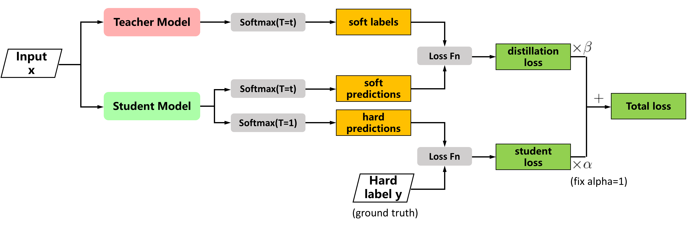

# Deep Learning 2025-0

## Pseudocode examples 

### Teacher-student Architecture



```python
for x, y in dataloader:

    soft_labels = SoftMax(teacher(x), T=t)
    hard_labels = y
    soft_predictions = SoftMax(student(x), T=t)  
    hard_predictions = SoftMax(student(x), T=1)  

    distillation_loss = LossFn(soft_predictions, soft_labels)
    student_loss = LossFn(hard_predictions, hard_labels)

    total_loss = α * student_loss + β * distillation_loss

    total_loss.backward()
    optimizer.step()
    optimizer.zero_grad()
```

### Bootstrap your own latent (BYOL)


```python
for x in dataloader:

    # Augmentations
    v = t(x)
    v` = t`(x)

    # Online network (student)
    z1 = gθ(fθ(v))
    z2 = gθ(fθ(v`))

    # Target network (teacher)
    z1` = gξ(fξ(v`))
    z2` = gξ(fξ(v))
    
    loss = H(z1, z1`) + H(z2, z2`)
    loss.backward()  

    # Update online network
    # θ = optimizer(θ, ∇θL, η)
    optimizer.step() 
    optimizer.zero_grad()

    # Target update rule (EMA)
    ξ = τ * ξ + (1 - τ) * θ


def H(s, t):
    t = t.detach()
    return 2 - 2 * (<qθ(s), t> / ‖qθ(s)‖ * ‖t‖)
```


### CycleGAN


```python
# A: zebra 🦓, B: horse 🐎
for A, B in dataloader:

    real_labels = torch.ones_like(A[:, 0])
    fake_labels = torch.zeros_like(A[:, 0])

    # train generators
    optim_G.zero_grad()

    fake_B = G_AB(A)  # zebra 🦓 → horse 🐎
    fake_A = G_BA(B)  # horse 🐎 → zebra 🦓

    loss_G_AB = criterion_gan(D_B(fake_B), real_labels)  # D_B(fake 🐎)
    loss_G_BA = criterion_gan(D_A(fake_A), real_labels)  # D_A(fake 🦓)

    recov_A = G_BA(fake_B)  # fake horse 🐎 → ~zebra 🦓
    recov_B = G_AB(fake_A)  # fake zebra 🦓 → ~horse 🐎

    loss_cycle_A = criterion_cycle(recov_A, A)  # ||A - recov_A||
    loss_cycle_B = criterion_cycle(recov_B, B)  # ||B - recov_B||

    loss_G = loss_G_AB + loss_G_BA + λ * (loss_cycle_A + loss_cycle_B)
    loss_G.backward()
    optim_G.step()  # optimiza ambos generadores G_AB y G_BA

    # train discriminator D_B
    optim_D_B.zero_grad()

    loss_real_B = criterion_gan(D_B(B), real_labels)
    loss_fake_B = criterion_gan(D_B(fake_B.detach()), fake_labels)
    loss_D_B = (loss_real_B + loss_fake_B) / 2
    loss_D_B.backward()
    optim_D_B.step()

    # train discriminator D_A
    optim_D_A.zero_grad()

    loss_real_A = criterion_gan(D_A(A), real_labels)
    loss_fake_A = criterion_gan(D_A(fake_A.detach()), fake_labels)
    loss_D_A = (loss_real_A + loss_fake_A) / 2
    loss_D_A.backward()
    optim_D_A.step()
```


